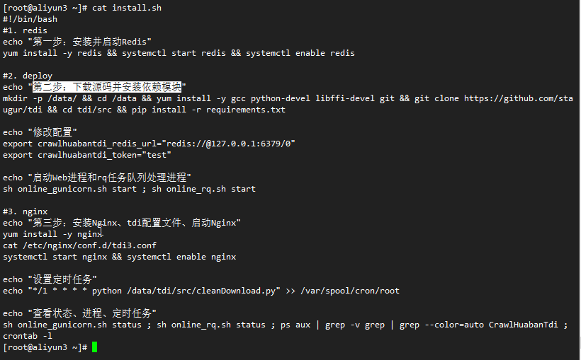

# Tdi
花瓣网、堆糖网下载油猴脚本的远程下载服务

此程序相当于`https://open.sainitc.com/CrawlHuaban`(中心端)的成员，用户选择远端下载后会由中心端选择一个成员提供给用户，减少中心端压力。

## 流程：

1. 成员端启动程序，到中心端页面`https://open.sainitc.com/CrawlHuaban/Register`注册成员端URL。
2. 中心端校验成员端规则<ping>，没问题注册到mysql(缓存到redis)。
3. 中心端定时检测成员端<ping>，查询其可用性、磁盘、负载、内存，并更新状态。
4. 用户请求时，中心端根据成员端状态和资源计算是否可用，然后从可用列表中随机分配。
5. 程序收到下载请求后，放入异步任务队列，下载完成后回调给中心端，实现提醒、记录等。
6. 定时执行`cleanDownload.py`脚本，清理已过期的压缩文件。

## 部署：

1. 要求： Python2.7和Redis
2. 下载： `git clone https://github.com/staugur/tdi && cd tdi/src`
3. 依赖： `pip install -r requirements.txt`
4. 配置： 即config.py，可以从环境变量中读取配置信息。
5. 启动： sh online_rq.sh start && sh online_gunicorn.sh start

> 部署图
> 

## 更多文档：

[点击查看文档](http://docs.saintic.com/946799 "点击查看部署及使用文档")，关于普通部署、Docker部署、使用手册、注意事项等问题。
若上述地址异常，备用地址是：[https://www.kancloud.cn/staugur/staugur/740838](https://www.kancloud.cn/staugur/staugur/740838)

## Nginx参考：
```
server {
    listen 80;
    server_name 域名;
    charset utf-8;
    #防止在IE9、Chrome和Safari中的MIME类型混淆攻击
    add_header X-Content-Type-Options nosniff;
    location /downloads {
        #下载程序目录
        alias /tdi/src/downloads/;
        default_type application/octet-stream;
        proxy_max_temp_file_size 0;
        if ($request_filename ~* ^.*?\.(zip|tgz)$){
            add_header Content-Disposition 'attachment;';
        }
    }
    location / {
       #13145是默认端口
       proxy_pass http://127.0.0.1:13145;
       proxy_set_header Host $host;
       proxy_set_header X-Real-IP $remote_addr;
       proxy_set_header X-Forwarded-Proto $scheme;
       proxy_set_header X-Forwarded-For $proxy_add_x_forwarded_for;
    }
}
```